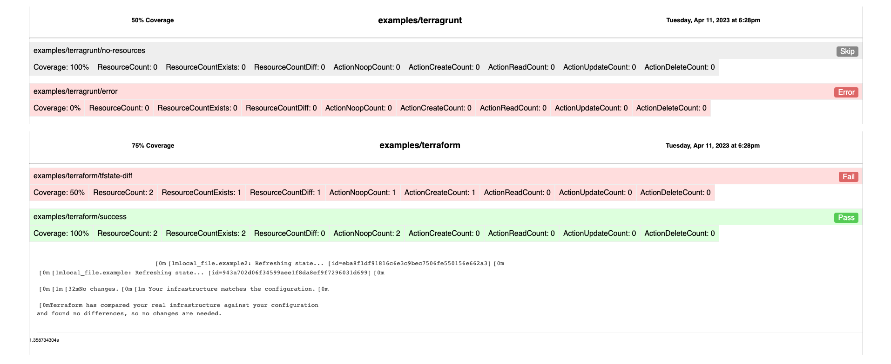

<h1 align="center">
  
</h1>

<h4 align="center">A recursive terraform repository tester powered by <a href="https://terratest.gruntwork.io/" target="_blank">Terratest</a>.</h4>

<p align="center">


</p>

<p align="center">
  <a href="#key-features">Key Features</a> •
  <a href="#install">Install</a> •
  <a href="#usage">Usage</a> •
  <a href="#quickstart">Quickstart</a> •
  <a href="#credits">Credits</a> •
  <a href="#support">Support</a> •
  <a href="#license">License</a>
</p>



<hr>


## Key Features

* Test in parallel multiple directory paths
* Export Results:
  * [junit](./examples/terracove.xml) with `--junit`
  * [json](./examples/terracove.json) summary with `--json`
  * [html](./examples/terracove.html) report with `--html`
* Generate `%` coverage for each module and root directory
* Ignore Errors and Empty Modules
* Supports [terraform](https://www.terraform.io/) and [terragrunt](https://terragrunt.gruntwork.io/) in the same directory tree


## Install

The recommended way to install on MacOS is via brew:

```sh
brew tap jatalocks/jatalocks
brew install terracove
```

If you'd like to use Docker, you can use the official image:
```sh
docker run --rm -v $(pwd):/data ghcr.io/jatalocks/terracove /data --json --junit --html
```

Or, you can install directly from release:
```sh
curl -sS https://raw.githubusercontent.com/jatalocks/terracove/main/install.sh | bash
```
## Usage

```sh
Usage:
  terracove [paths]... [flags]

Flags:
  -e, --exclude strings         Exclude directories while parsing tree
  -h, --help                    help for terracove
  -w, --html                    Output HTML Report
      --ignore-empty            Ignore Modules with 0 Resources
      --ignore-errors           Ignore Planning Errors
  -j, --json                    Output JSON
  -x, --junit                   Output Junit XML
      --minimal                 Don't Append Raw/JSON Plan to the Exported Output
      --o-html string           Output HTML Report File (default "terracove.html")
      --o-json string           Output JSON File (default "terracove.json")
      --o-junit string          Output Junit XML File (default "terracove.xml")
  -t, --validate-tf-by string   validate terraform by the existence of [filename] in a directory (default "main.tf")
  -g, --validate-tg-by string   validate terragrunt by the existence of [filename] in a directory (default "terragrunt.hcl")
  -v, --version                 version for terracove
```

## Quickstart
> Note that you must have terraform/terragrunt binaries installed on your machine

> The [examples](./examples) directory contains **4 modules**. 2 of them are [terraform](./examples/terraform) and 2 are [terragrunt](./examples/terragrunt). 
> 
> **Oh no!** It appears some of them have some problems. Let's see exactly what is going on.
> Clone this repository and give it a try.

```sh
git clone https://github.com/jatalocks/terracove.git
cd terracove
terracove --minimal --junit --json --html . 
# . == examples == examples/terraform examples/terragrunt
```

Open the **terracove.xml**, **terracove.json** or **terracove.html** and observe the results. You should see the following:

```json
[
 {
  "Timestamp": "1984-01-01T19:32:58+05:00",
  "Path": ".",
  "Results": [
   {
    "Path": "examples/terragrunt/no-resources",
    "ResourceCount": 0,
    "Coverage": 100,
    ...
   },
   {
    "Path": "examples/terragrunt/error",
    "Coverage": 0,
    ...
   },
   {
    "Path": "examples/terraform/tfstate-diff",
    "ResourceCount": 2,
    "ResourceCountDiff": 1,
    "Coverage": 50,
    ...
   },
   {
    "Path": "examples/terraform/success",
    "ResourceCount": 2,
    "ResourceCountExists": 2,
    "Coverage": 100,
    ...
   }
  ],
  "Coverage": 62.5
 }
]
```


## Credits

This project uses or is inspired by the following open source projects:

- [golang-cli-template](https://github.com/FalcoSuessgott/golang-cli-template)
- [terratest](https://terratest.gruntwork.io/)
- [docker-terragrunt](https://github.com/devops-infra/docker-terragrunt)
- [junit2html](https://github.com/kitproj/junit2html)
## Support

<a href="https://www.buymeacoffee.com/jatalocks" target="_blank"></a>

## License

[MIT](LICENSE)
